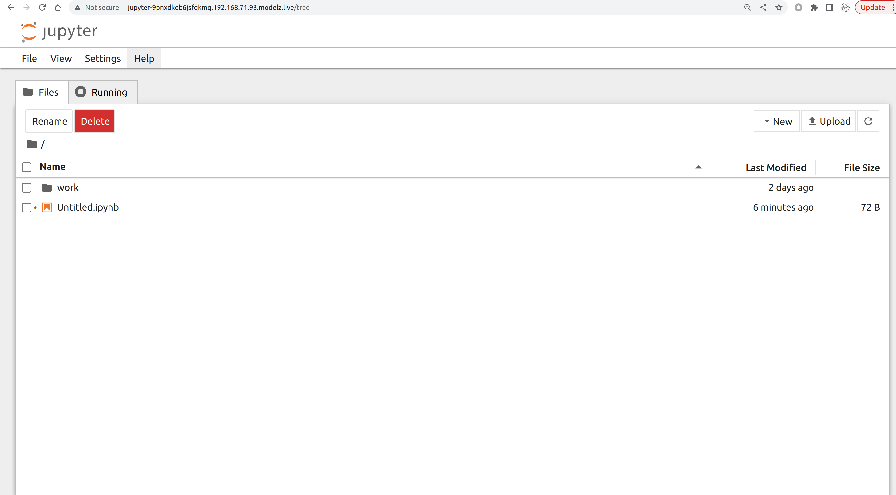

<div align="center">

# OpenModelZ

</div>

<p align=center>
<a href="https://discord.gg/KqswhpVgdU"></a>
<a href="https://twitter.com/TensorChord"></a>
<a href="https://docs.open.modelz.ai"></a>
<a href="https://github.com/tensorchord/openmodelz#contributors-"></a>
<a href="https://github.com/tensorchord/openmodelz/actions/workflows/CI.yaml"></a>
<a href="https://badge.fury.io/py/openmodelz"></a>
<a href='https://coveralls.io/github/tensorchord/openmodelz'></a>
</p>

## What is OpenModelZ?

OpenModelZ ( `mdz` ) is tool to deploy your models to any cluster (GCP, AWS, Lambda labs, your home lab, or even a single machine).

Getting models into production is hard for data scientists and SREs. You need to configure the monitoring, logging, and scaling infrastructure, with the right security and permissions. And then setup the domain, SSL, and load balancer. This can take weeks or months of work even for a single model deployment.

You can now use mdz deploy to effortlessly deploy your models. OpenModelZ handles all the infrastructure setup for you. Each deployment gets a public subdomain, like `http://jupyter-9pnxd.2.242.22.143.modelz.live`, making it easily accessible.

<p align=center>

</p>

## Benefits

OpenModelZ provides the following features out-of-the-box:

- 📈 **Auto-scaling from 0**: The number of inference servers could be scaled based on the workload. You could start from 0 and scale it up to 10+ replicas easily.
- 📦 **Support any machine learning framework**: You could deploy any machine learning framework (e.g. [vLLM](https://github.com/vllm-project/vllm)/[triton-inference-server](https://github.com/triton-inference-server/server)/[mosec](https://github.com/mosecorg/mosec) etc.) with a single command. Besides, you could also deploy your own custom inference server.
- 🔬 **Gradio/Streamlit/Jupyter support**: We provide a robust prototyping environment with support for [Gradio](https://gradio.app), [Streamlit](https://streamlit.io/), [jupyter](https://jupyter.org/) and so on. You could visualize your model's performance and debug it easily in the notebook, or deploy a web app for your model with a single command.
- 🏃 **Start from a single machine to a cluster of machines**: You could start from a single machine and scale it up to a cluster of machines without any hassle, with a single command `mdz server start`.
- 🚀 **Public accessible subdomain for each deployment** ( optional ) : We provision a separate subdomain for each deployment without any extra cost and effort, making each deployment easily accessible from the outside.

OpenModelZ is the foundational component of the ModelZ platform available at [modelz.ai](https://modelz.ai).

## How it works

Get a server (could be a cloud VM, a home lab, or even a single machine) and run the `mdz server start` command. OpenModelZ will bootstrap the server for you.

```text
$ mdz server start
🚧 Creating the server...
🚧 Initializing the load balancer...
🚧 Initializing the GPU resource...
🚧 Initializing the server...
🚧 Waiting for the server to be ready...
🐋 Checking if the server is running...
🐳 The server is running at http://146.235.213.84.modelz.live
🎉 You could set the environment variable to get started!

export MDZ_URL=http://146.235.213.84.modelz.live
$ export MDZ_URL=http://146.235.213.84.modelz.live
```

Then you could deploy your model with a single command `mdz deploy` and get the endpoint:

```
$ mdz deploy --image modelzai/gradio-stable-diffusion:23.03 --name sdw --port 7860 --gpu 1
Inference sd is created
$ mdz list
 NAME  ENDPOINT                                                 STATUS  INVOCATIONS  REPLICAS 
 sdw   http://sdw-qh2n0y28ybqc36oc.146.235.213.84.modelz.live   Ready           174  1/1      
       http://146.235.213.84.modelz.live/inference/sdw.default                                
```

## Quick Start 🚀

### Install `mdz`

You can install OpenModelZ using the following command:

```text copy
pip install openmodelz
```

You could verify the installation by running the following command:

```text copy
mdz
```

Once you've installed the `mdz` you can start deploying models and experimenting with them.

### Bootstrap `mdz`

It's super easy to bootstrap the `mdz` server. You just need to find a server (could be a cloud VM, a home lab, or even a single machine) and run the `mdz server start` command.

> Notice: We may require the root permission to bootstrap the `mdz` server on port 80.

```
$ mdz server start
🚧 Creating the server...
🚧 Initializing the load balancer...
🚧 Initializing the GPU resource...
🚧 Initializing the server...
🚧 Waiting for the server to be ready...
🐋 Checking if the server is running...
Agent:
 Version:       v0.0.13
 Build Date:    2023-07-19T09:12:55Z
 Git Commit:    84d0171640453e9272f78a63e621392e93ef6bbb
 Git State:     clean
 Go Version:    go1.19.10
 Compiler:      gc
 Platform:      linux/amd64
🐳 The server is running at http://192.168.71.93.modelz.live
🎉 You could set the environment variable to get started!

export MDZ_URL=http://192.168.71.93.modelz.live
```

The internal IP address will be used as the default endpoint of your deployments. You could provide the public IP address of your server to the `mdz server start` command to make it accessible from the outside world.

```bash
# Provide the public IP as an argument
$ mdz server start 1.2.3.4
```

You could also specify the registry mirror to speed up the image pulling process. Here is an example:

```bash /--mirror-endpoints/
$ mdz server start --mirror-endpoints https://docker.mirrors.sjtug.sjtu.edu.cn
```

### Create your first UI-based deployment

Once you've bootstrapped the `mdz` server, you can start deploying your first applications. We will use jupyter notebook as an example in this tutorial. You could use any docker image as your deployment.

```text
$ mdz deploy --image jupyter/minimal-notebook:lab-4.0.3 --name jupyter --port 8888 --command "jupyter notebook --ip='*' --NotebookApp.token='' --NotebookApp.password=''"
Inference jupyter is created
$ mdz list
 NAME     ENDPOINT                                                   STATUS  INVOCATIONS  REPLICAS
 jupyter  http://jupyter-9pnxdkeb6jsfqkmq.192.168.71.93.modelz.live  Ready           488  1/1
          http://192.168.71.93/inference/jupyter.default                                                                         
```

You could access the deployment by visiting the endpoint URL. The endpoint will be automatically generated for each deployment with the following format: `<name>-<random-string>.<ip>.modelz.live`.

It is `http://jupyter-9pnxdkeb6jsfqkmq.192.168.71.93.modelz.live` in this case. The endpoint could be accessed from the outside world as well if you've provided the public IP address of your server to the `mdz server start` command. 



### Create your first OpenAI compatible API server

You could also create API-based deployments. We will use [OpenAI compatible API server with Bloomz 560M](https://github.com/tensorchord/modelz-llm#run-the-self-hosted-api-server) as an example in this tutorial.

```text
$ mdz deploy --image modelzai/llm-bloomz-560m:23.07.4 --name simple-server
Inference simple-server is created
$ mdz list
 NAME           ENDPOINT                                                         STATUS  INVOCATIONS  REPLICAS 
 jupyter        http://jupyter-9pnxdkeb6jsfqkmq.192.168.71.93.modelz.live        Ready           488  1/1      
                http://192.168.71.93/inference/jupyter.default                                                 
 simple-server  http://simple-server-lagn8m9m8648q6kx.192.168.71.93.modelz.live  Ready             0  1/1      
                http://192.168.71.93/inference/simple-server.default                                           
```

You could use OpenAI python package and the endpoint `http://simple-server-lagn8m9m8648q6kx.192.168.71.93.modelz.live` in this case, to interact with the deployment.

```python
import openai
openai.api_base="http://simple-server-lagn8m9m8648q6kx.192.168.71.93.modelz.live"
openai.api_key="any"

# create a chat completion
chat_completion = openai.ChatCompletion.create(model="bloomz", messages=[
    {"role": "user", "content": "Who are you?"},
    {"role": "assistant", "content": "I am a student"},
    {"role": "user", "content": "What do you learn?"},
], max_tokens=100)
```

### Scale your deployment

You could scale your deployment by using the `mdz scale` command.

```text /scale/
$ mdz scale simple-server --replicas 3
```

The requests will be load balanced between the replicas of your deployment. 

You could also tell the `mdz` to **autoscale your deployment** based on the inflight requests. Please check out the [Autoscaling](https://docs.open.modelz.ai/deployment/autoscale) documentation for more details.

### Debug your deployment

Sometimes you may want to debug your deployment. You could use the `mdz logs` command to get the logs of your deployment.

```text /logs/
$ mdz logs simple-server
simple-server-6756dd67ff-4bf4g: 10.42.0.1 - - [27/Jul/2023 02:32:16] "GET / HTTP/1.1" 200 -
simple-server-6756dd67ff-4bf4g: 10.42.0.1 - - [27/Jul/2023 02:32:16] "GET / HTTP/1.1" 200 -
simple-server-6756dd67ff-4bf4g: 10.42.0.1 - - [27/Jul/2023 02:32:17] "GET / HTTP/1.1" 200 -
```

You could also use the `mdz exec` command to execute a command in the container of your deployment. You do not need to ssh into the server to do that.

```text /exec/
$ mdz exec simple-server ps
PID   USER     TIME   COMMAND
    1 root       0:00 /usr/bin/dumb-init /bin/sh -c python3 -m http.server 80
    7 root       0:00 /bin/sh -c python3 -m http.server 80
    8 root       0:00 python3 -m http.server 80
    9 root       0:00 ps
```

```text /exec/
$ mdz exec simple-server -ti bash
bash-4.4# 
```

Or you could port-forward the deployment to your local machine and debug it locally.

```text /port-forward/
$ mdz port-forward simple-server 7860
Forwarding inference simple-server to local port 7860
```

### Add more servers

You could add more servers to your cluster by using the `mdz server join` command. The `mdz` server will be bootstrapped on the server and join the cluster automatically.

```text /join/
$ mdz server join <internal ip address of the previous server>
$ mdz server list
 NAME   PHASE  ALLOCATABLE      CAPACITY        
 node1  Ready  cpu: 16          cpu: 16         
               mem: 32784748Ki  mem: 32784748Ki 
               gpu: 1           gpu: 1      
 node2  Ready  cpu: 16          cpu: 16         
               mem: 32784748Ki  mem: 32784748Ki 
               gpu: 1           gpu: 1      
```

### Label your servers

You could label your servers to deploy your models to specific servers. For example, you could label your servers with `gpu=true` and deploy your models to servers with GPUs.

```text /--node-labels gpu=true,type=nvidia-a100/
$ mdz server label node3 gpu=true type=nvidia-a100
$ mdz deploy ... --node-labels gpu=true,type=nvidia-a100
```

## Architecture

OpenModelZ is inspired by the [k3s](https://github.com/k3s-io/k3s) and [OpenFaaS](https://github.com/openfaas), but designed specifically for machine learning deployment. We keep the core of the system **simple, and easy to extend**.

You do not need to read this section if you just want to deploy your models. But if you want to understand how OpenModelZ works, this section is for you.

<p align=center>

</p>

OpenModelZ is composed of two components:

- Data Plane: The data plane is responsible for the servers. You could use `mdz server` to manage the servers. The data plane is designed to be **stateless** and **scalable**. You could easily scale the data plane by adding more servers to the cluster. It uses k3s under the hood, to support VMs, bare-metal, and IoT devices (in the future). You could also deploy OpenModelZ on a existing kubernetes cluster.
- Control Plane: The control plane is responsible for the deployments. It manages the deployments and the underlying resources.

A request will be routed to the inference servers by the load balancer. And the autoscaler will scale the number of inference servers based on the workload. We provide a domain `*.modelz.live` by default, with the help of a [wildcard DNS server](https://github.com/cunnie/sslip.io) to support the public accessible subdomain for each deployment. You could also use your own domain.

You could check out the [architecture](https://docs.open.modelz.ai/architecture) documentation for more details.

## Roadmap 🗂️

Please checkout [ROADMAP](https://docs.open.modelz.ai/community).

## Contribute 😊

We welcome all kinds of contributions from the open-source community, individuals, and partners.

- Join our [discord community](https://discord.gg/KqswhpVgdU)!

## Contributors ✨

<!-- ALL-CONTRIBUTORS-LIST:START - Do not remove or modify this section -->
<!-- prettier-ignore-start -->
<!-- markdownlint-disable -->
<table>
  <tbody>
    <tr>
      <td align="center" valign="top" width="14.28%"><a href="https://github.com/gaocegege"><br /><sub><b>Ce Gao</b></sub></a><br /><a href="https://github.com/tensorchord/openmodelz/commits?author=gaocegege" title="Code">💻</a> <a href="https://github.com/tensorchord/openmodelz/pulls?q=is%3Apr+reviewed-by%3Agaocegege" title="Reviewed Pull Requests">👀</a> <a href="#tutorial-gaocegege" title="Tutorials">✅</a></td>
      <td align="center" valign="top" width="14.28%"><a href="https://github.com/VoVAllen"><br /><sub><b>Jinjing Zhou</b></sub></a><br /><a href="#question-VoVAllen" title="Answering Questions">💬</a> <a href="https://github.com/tensorchord/openmodelz/issues?q=author%3AVoVAllen" title="Bug reports">🐛</a> <a href="#ideas-VoVAllen" title="Ideas, Planning, & Feedback">🤔</a></td>
      <td align="center" valign="top" width="14.28%"><a href="https://blog.mapotofu.org/"><br /><sub><b>Keming</b></sub></a><br /><a href="https://github.com/tensorchord/openmodelz/commits?author=kemingy" title="Code">💻</a> <a href="#design-kemingy" title="Design">🎨</a> <a href="#infra-kemingy" title="Infrastructure (Hosting, Build-Tools, etc)">🚇</a></td>
      <td align="center" valign="top" width="14.28%"><a href="http://manjusaka.itscoder.com/"><br /><sub><b>Nadeshiko Manju</b></sub></a><br /><a href="https://github.com/tensorchord/openmodelz/issues?q=author%3AZheaoli" title="Bug reports">🐛</a> <a href="#design-Zheaoli" title="Design">🎨</a> <a href="#ideas-Zheaoli" title="Ideas, Planning, & Feedback">🤔</a></td>
      <td align="center" valign="top" width="14.28%"><a href="https://github.com/tddschn"><br /><sub><b>Teddy Xinyuan Chen</b></sub></a><br /><a href="https://github.com/tensorchord/openmodelz/commits?author=tddschn" title="Documentation">📖</a></td>
      <td align="center" valign="top" width="14.28%"><a href="https://page.codespaper.com"><br /><sub><b>Wei Zhang</b></sub></a><br /><a href="https://github.com/tensorchord/openmodelz/commits?author=zwpaper" title="Code">💻</a></td>
      <td align="center" valign="top" width="14.28%"><a href="https://xuanwo.io/"><br /><sub><b>Xuanwo</b></sub></a><br /><a href="#content-Xuanwo" title="Content">🖋</a> <a href="#design-Xuanwo" title="Design">🎨</a> <a href="#ideas-Xuanwo" title="Ideas, Planning, & Feedback">🤔</a></td>
    </tr>
    <tr>
      <td align="center" valign="top" width="14.28%"><a href="https://github.com/cutecutecat"><br /><sub><b>cutecutecat</b></sub></a><br /><a href="#ideas-cutecutecat" title="Ideas, Planning, & Feedback">🤔</a></td>
      <td align="center" valign="top" width="14.28%"><a href="https://xieydd.github.io/"><br /><sub><b>xieydd</b></sub></a><br /><a href="#ideas-xieydd" title="Ideas, Planning, & Feedback">🤔</a></td>
    </tr>
  </tbody>
</table>

<!-- markdownlint-restore -->
<!-- prettier-ignore-end -->

<!-- ALL-CONTRIBUTORS-LIST:END -->

## Acknowledgements 🙏

- [K3s](https://github.com/k3s-io/k3s) for the single control-plane binary and process.
- [OpenFaaS](https://github.com/openfaas) for their work on serverless function services. It laid the foundation for OpenModelZ.
- [sslip.io](https://github.com/cunnie/sslip.io) for the wildcard DNS service. It makes it possible to access the server from the outside world without any setup.
