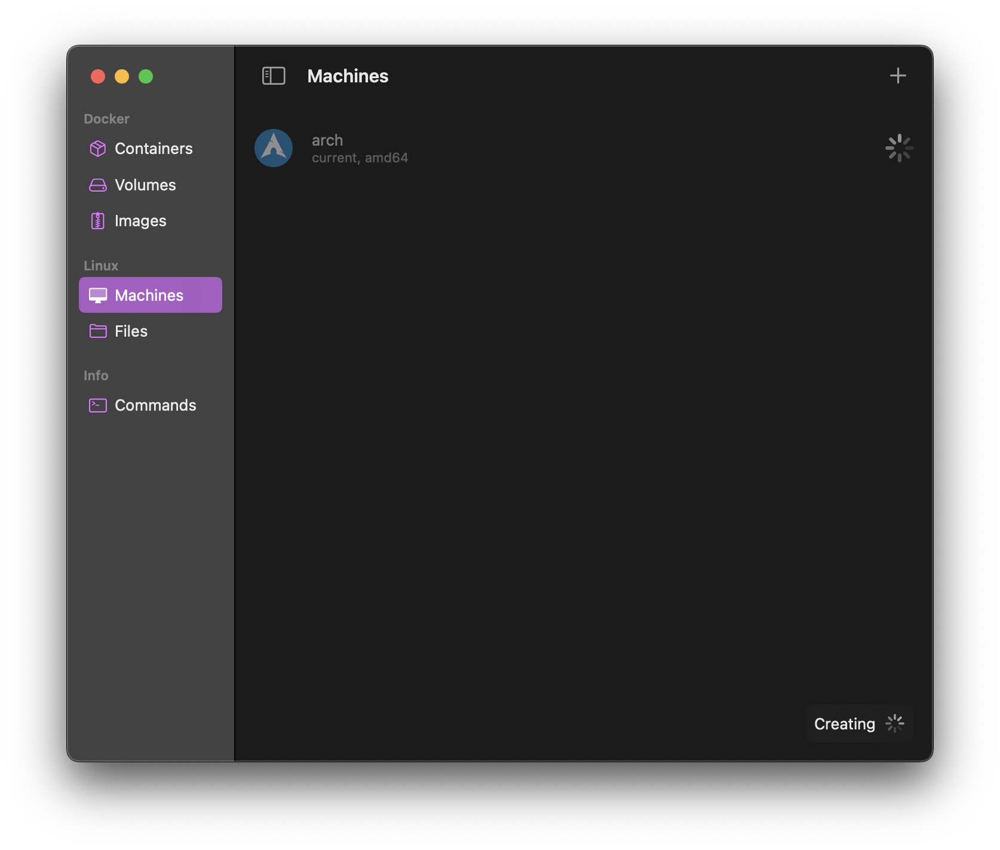

# `mdz` Quick Start Guide for macOS

`mdz` only runs on Linux. To use it on macOS, you'll need a Linux VM. This guide will show you how to set up a Linux VM on macOS, install and use `mdz` on it.

- [`mdz` Quick Start Guide for macOS](#mdz-quick-start-guide-for-macos)
  - [VM Setup](#vm-setup)
  - [Install `mdz`](#install-mdz)
    - [Drop into the VM shell](#drop-into-the-vm-shell)
    - [Install build dependencies](#install-build-dependencies)
    - [Clone the repository and build](#clone-the-repository-and-build)
  - [`mdz` Usage](#mdz-usage)

## VM Setup

I use [OrbStack](https://docs.orbstack.dev/machines/) to create and manage my VMs. 



Open OrbStack and go to the `Linux Machines` tab, then click `Create` button to create a new VM if you don't already have one.

This guide uses Archlinux, but you're free to use any distribution you like.

## Install `mdz`

### Drop into the VM shell

```
orb
# now you're in the Linux VM's shell
```

### Install build dependencies

```
# or use your favorite package manager
sudo pacman -Sy go git
```

### Clone the repository and build

```
git clone https://github.com/tensorchord/OpenModelZ.git
cd OpenModelZ/mdz && make
# `make` will build the `mdz` binary under `bin/` for you
```

## `mdz` Usage

```
# replace with your `mdz` path, typically it's `./bin/mdz`
mdz --help
```


